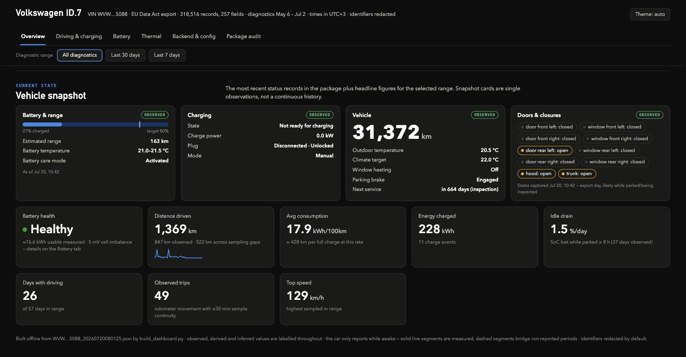
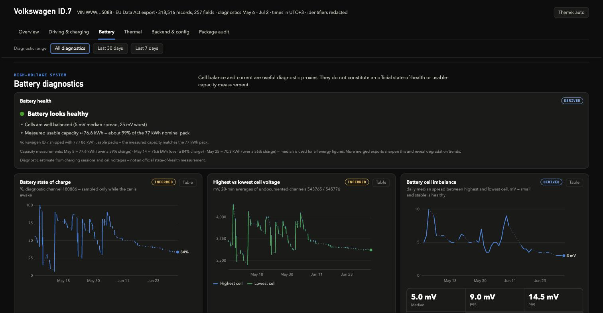

# VW EU Data Act Dashboard

Turn the raw data export Volkswagen gives you under the **EU Data Act** into a
readable, interactive, fully offline dashboard — driving, charging, battery
health, thermal system, backend activity, and an audit of how complete the
package actually is.

One Python script, no server, no accounts, no telemetry. The output is a single
`dashboard.html` you open in any browser — including a plain-language
**battery health verdict** with a *measured* usable capacity, which makes this
tool especially useful when **buying a used VW EV** (see below).

The portal serves the **participating Volkswagen Group brands** — Volkswagen
Passenger Cars, Volkswagen Commercial Vehicles, Audi, Škoda, SEAT, Cupra and
Bentley — and this tool reads their common export format. Best supported is
the **MEB EV family**: VW ID.3/ID.4/ID.5/ID.7/ID. Buzz, and their platform
siblings **Cupra Born/Tavascan, Škoda Enyaq/Elroq, Audi Q4 e-tron** (same
platform, same 96-series battery packs, so the battery analysis applies).
Model and pack sizes are detected from the VIN. Built and reverse-engineered
against a VW ID.7 export; the high-frequency diagnostic channels were
validated on that car, so treat other models' inferred channels with a little
extra skepticism — and please open an issue with your results on other Group
cars. Non-MEB vehicles (e.g. Audi's PPE models, combustion cars) will still
get the documented fields and the package audit, but the battery inferences
won't apply.





## What you get

- **Overview** — current vehicle snapshot (SoC, range, closure and lock states,
  window opening, lights, charging policy, climate, connectivity, service due)
  and headline figures: distance, consumption, energy charged, idle drain, top speed
- **Driving & charging** — distance per day (reconciled to the odometer),
  driving heatmap by weekday/hour, speed distribution, energy consumption per
  day with ambient temperature context, a charging ledger (AC / DC fast /
  scheduled — classified from the power-curve shape, with estimated kWh and
  power), a trip ledger with an independent ∫I·V consumption cross-check and
  regen/traction split, and parked-drain events annotated with the
  thermal-mode mix (conditioning vs quiet parks)
- **Battery** — a plain-language **battery health verdict** (healthy / normal
  wear / worth checking) with the evidence behind it — including a
  session-by-session table of how the usable capacity was measured (SoC
  window, current coverage, AC/DC) — state of charge, highest/lowest cell
  voltage, cell imbalance over time and by SoC band, HV current
- **Thermal** — ambient temperature, operating modes, seven thermal sensors as
  small multiples, coolant flow and valve-actuation timelines
- **Backend & config** — remote actions, vehicle reports, backend errors, and a
  decoded configuration snapshot
- **Package audit** — what VW's own Data Dictionary says exists vs. what your
  export actually contains (useful if you want to complain — see below)

Every value is labelled **observed** (directly in the export), **derived**
(calculated from observed samples) or **inferred** (undocumented channel whose
meaning was reverse-engineered). Solid line segments are measured; dashed
segments bridge periods where the car wasn't reporting.

## Getting your data from the Volkswagen Group portal

1. Go to the Volkswagen Group's EU Data Act portal:
   **<https://eu-data-act.drivesomethinggreater.com/de/en>**
2. **Select your vehicle's brand** (Volkswagen, Audi, Škoda, SEAT, Cupra,
   Bentley, VW Commercial Vehicles) and sign in with that brand's ID account.
   The vehicle must be linked to your account as owner/primary user.
3. Request the **historical data** package for your vehicle.
4. Wait for the notification that the package is ready (this can take a while),
   then download it. **The download link expires after ~7 days**, so don't sit
   on it.
5. ⚠️ **Check the file size — first attempts often come back near-empty.** In
   practice the portal frequently delivers an incomplete package on the first
   request (a JSON of a few KB with only a handful of snapshot fields). A real
   package with diagnostic history is **tens of MB** with hundreds of
   thousands of records. If yours is tiny, simply **request the export again —
   it can take two or more attempts** until a complete file arrives. The
   script prints the record count when it runs, so you'll see immediately
   whether you got a real one.
6. Unzip the package. Inside you should find one or more `.json` files named
   after your VIN (e.g. `WVWZZZ...123_20260720080125.json`). That JSON is the
   only file this tool needs — everything else (including the field
   descriptions from VW's Data Dictionary) is built into the script.

## Usage

Requires Python 3.9+ and **nothing else** — no packages to install, and the
only input file you need is the export JSON (field descriptions from VW's
Data Dictionary are bundled into the script).

Put your export JSON next to the script, then:

```bash
python3 build_dashboard.py
```

That's it — open the generated `dashboard.html` in a browser. **No configuration
is needed**: the script detects your model from the VIN, your timezone from the
vehicle's own clock, and measures your battery's usable capacity from your
charging sessions (falling back to sensible defaults when it can't). Everything
it decided is printed as it runs. To be explicit instead:

```bash
python3 build_dashboard.py export.json -o dashboard.html
```

### Options

| Flag | What it does |
|---|---|
| `exports...` | one **or more** export JSONs — multiple files are merged and deduplicated |
| `-o / --out` | output HTML path (default `dashboard.html` next to the export) |
| `--csv` | also write cleaned per-series CSV files (SoC, odometer, speed, charges, trips…) |
| `--price-kwh 0.21` | electricity price — adds cost estimates to the charging ledger |
| `--currency €` | currency symbol for `--price-kwh` |
| `--utc-offset 2` | override the auto-detected display timezone (hours from UTC) |
| `--pack-kwh 86` | override the measured/assumed usable battery capacity |
| `--vehicle-title "VW ID.4"` | override the VIN-detected vehicle name |
| `--include-identifiers` | keep full VIN and backend/user IDs in the HTML (redacted by default) |

### Build an archive over time

VW retains only **about two months** of the high-frequency diagnostic history.
The script therefore accepts any number of exports and merges them:

```bash
python3 build_dashboard.py export_may.json export_july.json export_september.json
```

Request a fresh export every ~6 weeks, keep the JSONs, and your dashboard grows
a history deeper than any single package VW will ever give you — seasonal
consumption, battery-health trends, the lot.

## Buying a used MEB EV? (ID.3/4/5/7, Buzz, Born, Enyaq, Q4 e-tron…)

This might be the tool's best use. The battery is the single most expensive
component of a used EV, and dealers rarely show you a real state-of-health
figure. But **the seller can get the data for free**: under the EU Data Act,
any owner can request their vehicle's data export from the Group's portal
(see "Getting your data" above). So:

1. Ask the seller to request the historical data package for the car and send
   you the JSON — it costs them nothing but a few clicks and a few days' wait.
   Ask **early**: the export takes days to arrive and covers roughly the last
   two months of driving.
2. Run this script on the file. You get an independent report:
   - **Measured usable battery capacity and state of health** — measured from
     actual charging sessions, matched against the pack sizes that model
     shipped with (a pack measuring 80 kWh can only be a degraded 86 kWh pack,
     never a healthy 77 — the tool reasons accordingly)
   - **Cell imbalance** — an early-warning indicator a range test won't show
   - **Odometer cross-check** — the diagnostic odometer channel vs. the
     reported mileage field, a basic tampering sanity check
   - **Usage patterns** — DC fast-charge share, charges past 80%, deep
     discharges, idle drain: how the battery was actually treated
3. A seller who refuses to share a free, privacy-redacted export about the
   car they're selling is also telling you something.

The export contains no location data (verified on the export this tool was
built against), and the dashboard redacts the VIN and account identifiers by
default, so sellers aren't exposing anything sensitive by sharing it.

## Battery health & measured capacity

The dashboard gives a direct verdict — **healthy / normal wear / worth
checking** — built from two measurable indicators:

- **Measured usable capacity.** For every charging session that gained ≥30%
  SoC while the car was reporting, the script integrates battery current ×
  pack voltage (mean cell voltage × 96 series cells, the MEB layout) and
  divides by the SoC gained. The median across sessions is your pack's
  measured usable capacity. The nominal pack for the state-of-health
  percentage is chosen from the sizes **that model actually shipped with**
  (from the VIN): ID.3 → 45/52/58/77/79 kWh, ID.4/ID.5 → 52/77/79, ID.7 and
  ID. Buzz → 77/86 — picking the smallest option the measurement can fit,
  since packs only lose capacity. All energy figures in the dashboard use the
  measured value automatically.
- **Cell imbalance.** The spread between the highest and lowest cell voltage.
  A healthy pack stays in the single-digit millivolts; a consistently large or
  growing spread is an early warning sign worth a service check.

Merge several exports over time and the per-charge capacity measurements
become a **degradation trend** — the number the manufacturer doesn't show you.

This is a diagnostic estimate measured at the battery (charger losses
excluded), not an official state-of-health certificate — treat "worth
checking" as a prompt to investigate, not a diagnosis.

## Two export formats

The portal delivers (at least) two different package formats, and the tool
handles both:

- **Diagnostic-channel format** (seen on a VW ID.7): hundreds of thousands of
  records in undocumented numeric channels — odometer, SoC, cell voltages,
  speed, current — from which trips, battery health and everything else are
  reconstructed. Roughly two months of history.
- **Structured format** (seen on a Škoda Enyaq): no numeric channels at all;
  instead documented `chargingSession.[n]` records (start/end, SoC window,
  energy, average/peak power, AC/DC), `powerCurve` samples for recent
  sessions, daily charged-energy aggregates — and high-volume event records
  (`speed`, `ignition`) delivered **without values**, timestamps only. Around
  eight months of history. Here the charging ledger and power curves are the
  vehicle's own figures (labelled *observed*), usable capacity is measured
  from reported session energy over the SoC gained, and the driving heatmap
  is built from the value-less activity events; odometer/trip history simply
  isn't in the package and the dashboard says so.

## Data quality notes

- The export contains sensor **error values** the script filters out: SoC
  readings of `0`, odometer readings of `1048574`, temperatures of `0 K`.
- Over 90% of the records sit in **numeric channels that VW's own Data
  Dictionary does not document**. Their meanings here (odometer, SoC, cell
  voltages, speed, …) were inferred from units, value ranges and cross-checks
  against documented snapshot fields, and are labelled *inferred* in the UI.
- Energy figures (kWh, kWh/100km, charge power) are estimated from SoC deltas
  and the assumed pack capacity — good for trends, not billing.
- **No location or route data**: a systematic search of every channel in the
  reference export — including the opaque numeric channels and long encoded
  values — found no coordinates, addresses, route objects or serialized
  journey payloads. The only movement evidence is the odometer, speed and
  battery-current telemetry the dashboard already uses; kilometres inside
  odometer sampling gaps are reported with whatever sparse timing evidence
  exists, never reconstructed into trips.
- Timestamps in the export are UTC; display uses `--utc-offset`.

## Is the package complete? (spoiler: probably not)

The **Package audit** tab compares your export against VW's own Data
Dictionary. In the export this tool was built on, VW delivered 233 of 5,140
documented data point keys, and categories the dictionary explicitly defines —
warning lights, diagnostic trouble codes — were missing entirely, while the
same warnings were visible in the VW app. No location data was present.

Under the **EU Data Act (Regulation 2023/2854, Arts. 4–5)** and **GDPR
(Arts. 15/20)** you are entitled to the data VW holds, in a usable format. The
audit tab gives you the concrete field names and numbers to cite if you decide
to push back through the portal's contact form.

## Privacy

- Everything runs **locally**; the dashboard is a static file and makes no
  network requests.
- The VIN and backend/user identifiers are **redacted by default** in the HTML
  (`--include-identifiers` to keep them).
- `dashboard.html` still contains your driving history — share it deliberately.
- The included `.gitignore` keeps exports and generated dashboards out of
  version control. **Never commit your export.**

## License

MIT — see [LICENSE](LICENSE).
